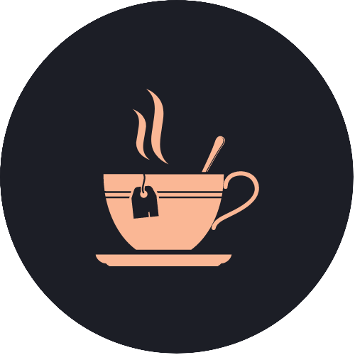
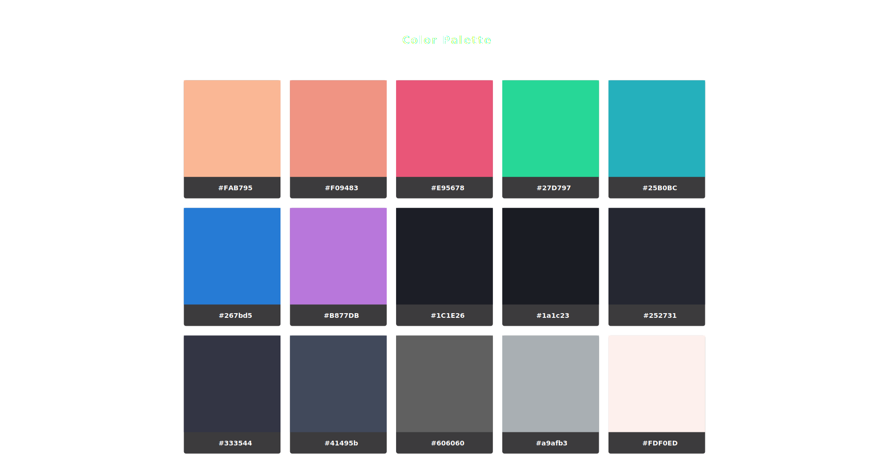

 
    

 

 
   🍵 A dark, warm theme for those who work at night

---

 
    
    

    <h3>Available Themes</h3>
    <h3><a href="https://github.com/midnight-tea/konsole">🖥️ Konsole</a></h3>
    
     
    <h3><a href="https://github.com/midnight-tea/kde">🐬 Dolphin</a></h3>
    
     
    <h3><a href="https://github.com/midnight-tea/vscode">🚀 Visual Studio Code</a></h3>
    
     

 

---